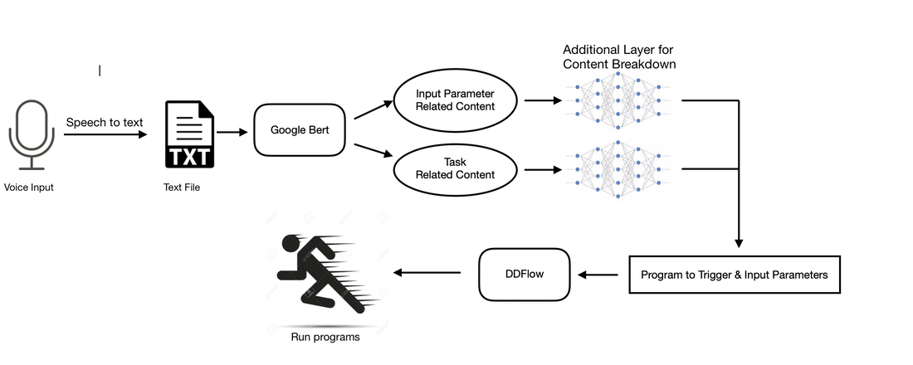

### Overview

The goal of this project is to enable a “digital assistant” system that listens to user commands and coordinates distributed applications spanning multiple devices including sensors/actuators.

### Goals

Baseline: a static set of macro-programs over a static set of devices.

Next phase: a static set of macro-programs over dynamic device set, along with parameter generation.

Stretch goal: dynamically “assemble” macro-programs (if have time).

### System Flowchart

### Specifications

### Support or Contact

Having trouble with Pages? Check out our [documentation](https://help.github.com/categories/github-pages-basics/) or [contact support](https://github.com/contact) and we’ll help you sort it out.
